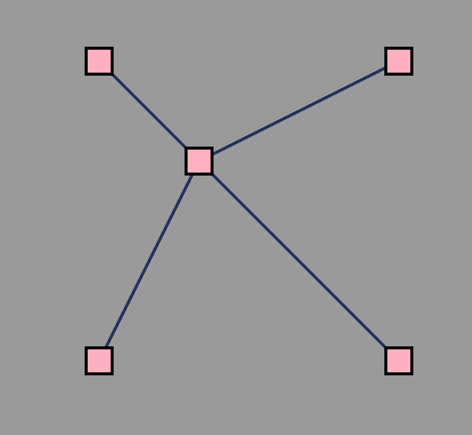
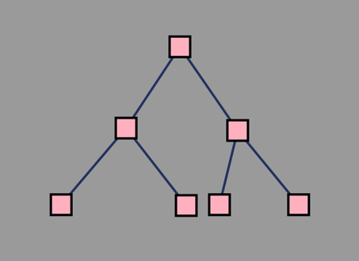

# redux-react-d3-flow-graph
<a href='https://www.npmjs.com/package/redux-graph-flow'>redux-graph-flow</a> as a npm package





## a tree flow graph component
This will be a simple react component which showing how to draw a tree graph with d3, and synchronize state with other components, using Redux.

When we want to draw a flow which can be operated on the page  and synchroize state with the persistence layer(e.g. ReduxStore/Server/DB). As far as I am concerned there are two sort of operations which should be provide to the user:

* Firstly, Operations upon <b>Node</b>
    * ADD / DELETE / DRAG POSITION
        * to manipulate the nodes in the flow
    * ACTIVATE (hover or click) to get the current [node] details
        * active particular node and get detail of the node
        * update the detail information in the current activated node

* And Secondly, Operations upon <b>Link</b>
    * ADD / DELETE 
        * manipulate the links in the flow
    * ACTIVATE (hover or click) to:
        * get the current selected [link]'s details info
        * activate the editable state, and update the link info.

* Along with each operations, an Redux Action will be emitted to update the Redux Store, if necessary, update the remote server state using redux-thunk or redux-saga.

## start a develop server
* use the command below to start the webpack-dev-server with hot module reloading

```npm start```

then open the ```http://localhost:9000/```in your browser.
<>

## eslint 
* use the command below to lint the code
```npm run eslint```

* and this command to fix eslint warnnings & errors
```npm run eslint:fix```
